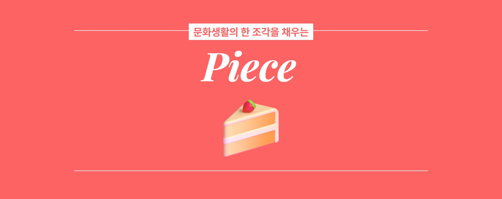
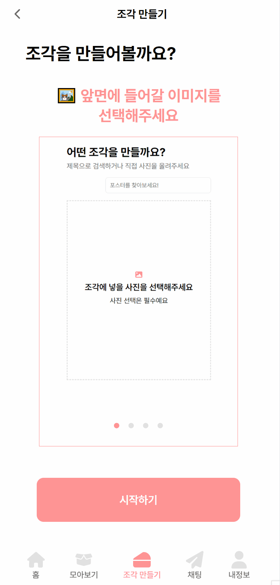
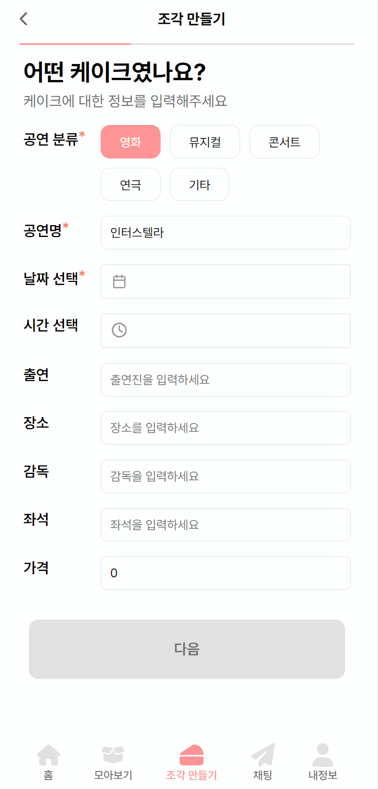
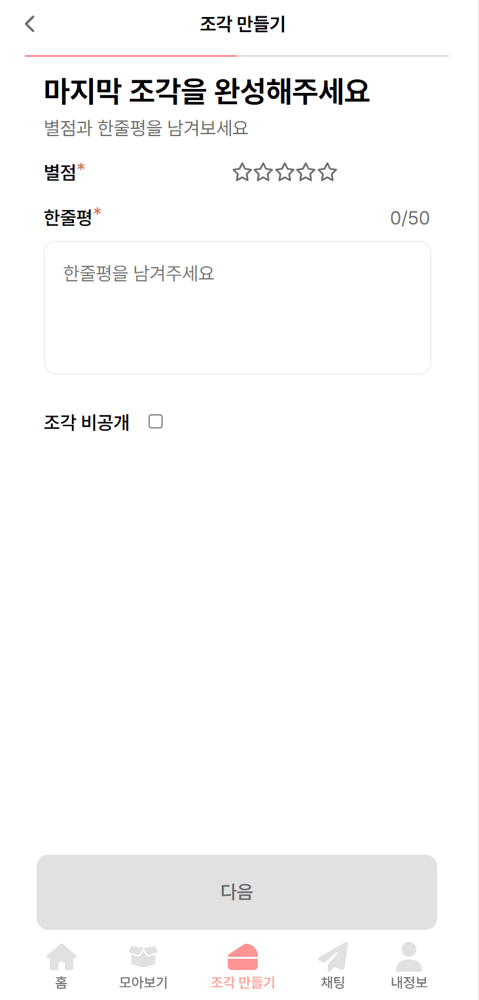
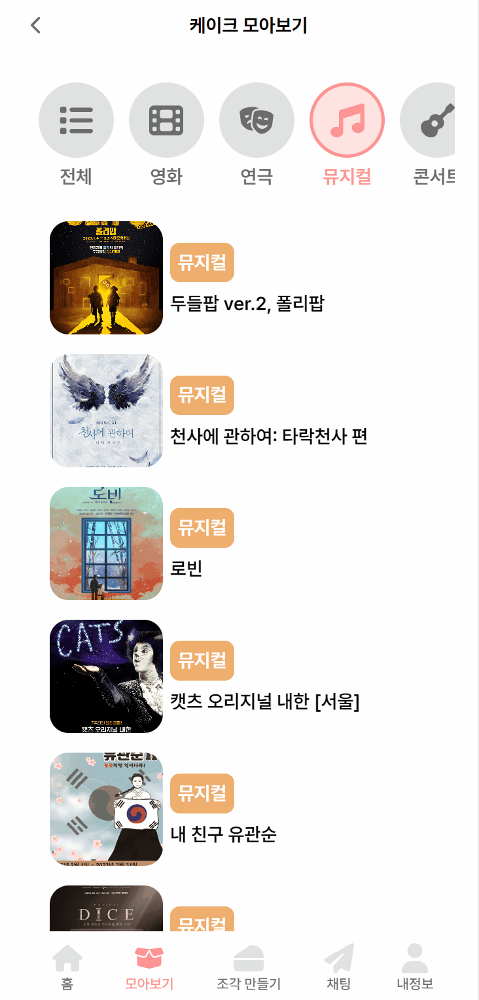
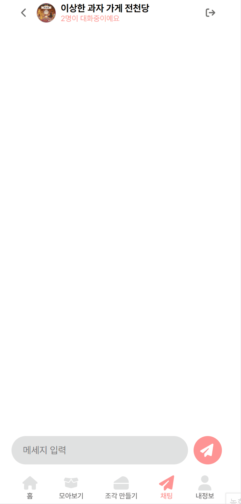
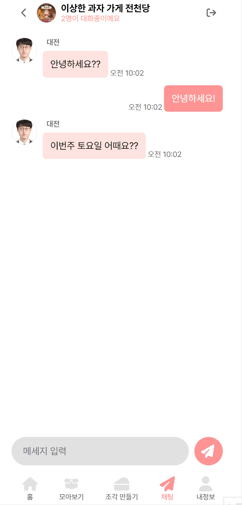
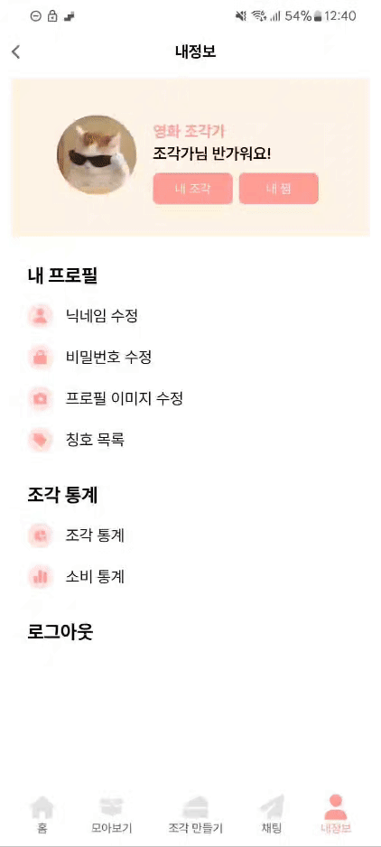
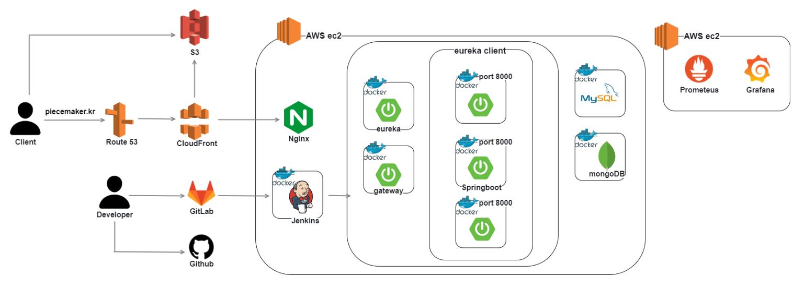
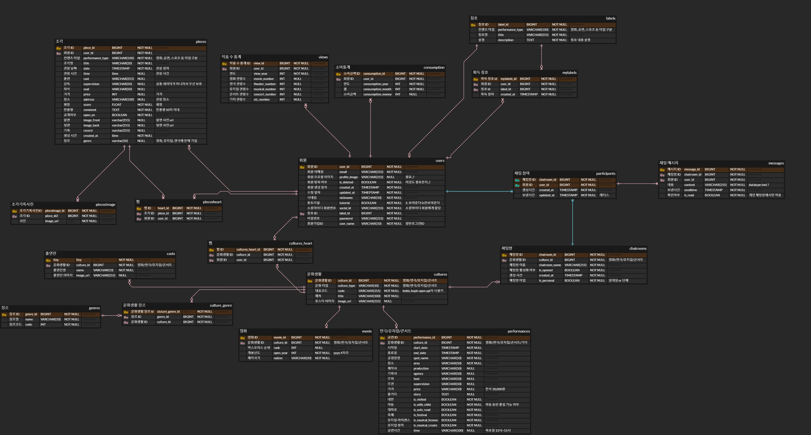

# 🍰 PIECE - 문화생활의 한 조각을 채우는

# 🌟 서비스 소개

영화 티켓을 모은 적이 있으신가요?
영화, 연극, 뮤지컬, 콘서트의 감상평을 남긴 적이 있으신가요?

저희는 사진과 생성형 AI를 통해 나만의 티켓 이미지를 만들어
간단하게 문화생활의 마지막 조걱을 채우고자 시작했습니다.

PIECE에서 문화생활의 한 조각을 채워보세요!

 
 

# 💡 주요 기능

 
 
 
### 🍰 조각 만들기
- 사진을 업로드하거나 제목으로 포스터를 검색할 수 있어요.

- 조각에 공연명, 날짜, 시간, 출연진 등 정보를 입력할 수 있어요.

- 별점과 감상평을 남길 수 있어요.

- 조각 레이아웃을 선택할 수 있어요.
- 생성형 AI를 통해 나만의 조각을 완성할 수 있어요.

 
 

### 🍰 조각 모아보기
- 내 조각을 캘린더 형식으로 볼 수 있어요.

- 조각을 찜하거나 링크를 공유할 수 있어요.

- 자세히 기록하기를 통해 사진과 글을 추가로 작성할 수 있어요.

 
 

### 🍰 케이크 모아보기
- 다양한 케이크의 정보를 한 눈에 볼 수 있어요.

- 하나의 케이크에서 다른 사람들과 채팅을 나눌 수 있어요.

 
 

### 🍰 채팅하기
- 하나의 케이크에서 비롯된 오픈 채팅을 나눌 수 있어요.

- 1:1 채팅을 나눌 수 있어요.

 
 

### 🍰 나만의 공간
- 조각을 완성하면 다양한 칭호가 주어져요.

- 내가 만든 조각으로 조각 통계를 보여드려요.
- 조각에 작성한 정보를 바탕으로 소비 통계를 보여드려요.

 
 

# 🛠️ 주요 기술 스택

-   Infra : AWS, Jenkins, Docker, Nginx, Grafana, Prometheus
-   BackEnd : Java, Spring, JPA
-   FrontEnd : Vue.js
-   DataBase : MySQL, MongoDB
-   Etc : AmazonS3, GitLab
 

- ***MSA***
    - 케이크 모아보기의 채팅 서비스에 트래픽이 높은 비중으로 집중될 것이 예상되어, 이로 인한 장애가 다른 서비스로 전파되지 않기 위함
    - 추후 채팅 서버만 효율적으로 증설 가능

- ***PWA (Progressive Web Application)***
    - 네이티브 앱처럼 사용할 수 있는 웹 어플리케이션
    - 안드로이드, iOS에서 앱으로 동작 가능
    - Service Worker를 통한 assets 및 일부 API 캐싱 지원

- ***S3***
    - 티켓 생성이 많아질 경우, presignedURL을 사용하여 클라이언트가 서버를 거치지 않고 파일을 저장소에 직접 업로드하여 서버 자원 절약
    - S3와 CloudFront를 연동하여 콘텐츠 캐싱을 통해 S3 부하 감소
    - Edge Location을 통한 응답 속도를 향상
    - 콘텐츠 보안을 유지

- ***WebSocket***
    - 서버와의 실시간 데이터 전송
    - 각 케이크(공연)별 단체 채팅 구현
    - 회원간 1 : 1 채팅 구현

- ***JWT***
    - 사용자가 로그인을 유지하고 안전하게 서버 자원에 접근할 수 있도록 함

- ***모니터링***
    - Grafana, Prometheus를 이용한 모니터링
    - MSA 환경에서 다수의 서버 관리와 예기치 않은 서버 다운에 대한 신속한 대응을 위한 모니터링 서버 구축
    - 트래픽의 흐름을 한 눈에 측정이 가능하기 때문에 서버 증설 계획을 빠르게 세울 수 있음

 
 

# ⚙ 시스템 아키텍처

 
 

# 🎂 팀원 소개 및 프로젝트 기간
<!-- <table>
    <tr>
        <td height="140px" align="center"> 
                이혜진  (Full-Stack) </a>  </td>
        <td height="140px" align="center"> 
                권근형  (Full-Stack) </a>  </td>
        <td height="140px" align="center"> 
                김현진  (Infra) </a>  </td>
        <td height="140px" align="center"> 
                노현석  (Full-Stack) </a>  </td>
        <td height="140px" align="center"> 
                이아진  (Full-Stack) </a>  </td>
        <td height="140px" align="center"> 
                김보라  (Full-Stack) </a>  </td>         
    </tr>
    <tr>
        <td width="256" align="center">
        [BE] 조각만들기 
         
        [FE] 조각 모아보기
         </td>
        <td width="256" align="center">
        [BE] 로그인, 보안
         
        [FE] 로그인
         </td>
        <td width="256" align="center">
        [INFRA] 서버 구축
         
        [BE] 이미지 저장  
         
        [FE] 조각 통계
         </td>
        <td width="256" align="center">
        [INFRA] MSA
         
        [BE] 케이크 모아보기  
         
        [FE] 조각 만들기
         </td>
        <td width="256" align="center">
        [BE] 채팅 
         
        [FE] 채팅
         </td>    
       <td width="256" align="center">
        [BE] 조각 통계, 조각 검색 
         
        [FE] 조각 만들기
         </td>   
    </tr>
</table> -->

| 팀원 | 역할 |
|:--------------------------------:|:--------------------------------:|
| 👑 이혜진 | [BE] 조각만들기,칭호   [FE] 조각 모아보기, 칭호 |
| 🍰 권근형 | [BE] 로그인, 보안   [FE] 로그인 |
| 🍰 김현진 | [INFRA] 서버 구축   [BE] 이미지 저장   [FE] 조각 통계 |
| 🍰 노현석 | [INFRA] MSA   [BE] 케이크 모아보기    [FE] 조각 만들기|
| 🍰 이아진 | [BE] 채팅   [FE] 채팅 |
| 🍰 김보라 | [BE] 조각 통계, 조각 검색   [FE] 조각 만들기 |

### 🍰 조각가들 : 24.4.09 ~ 24.05.19

 
 

# 📝 설계 문서

### ERD

### [API 명세서](https://lab.ssafy.com/s10-final/S10P31B202/-/blob/master/exec/asset/API_%EB%AA%85%EC%84%B8%EC%84%9C.pdf)
